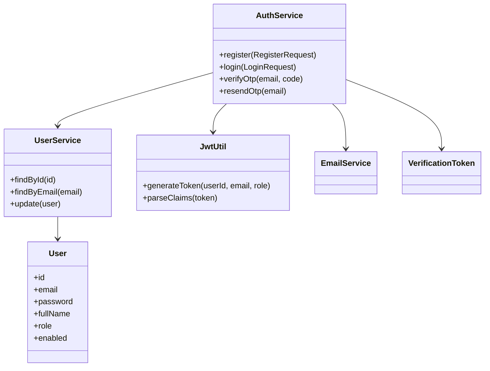
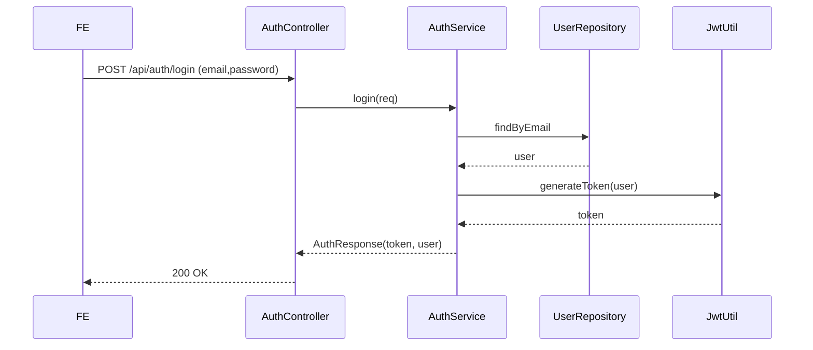
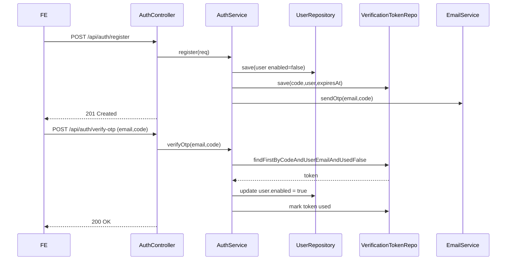

**Authentication & User Service Design**

Use cases

- Authentication: verify JWT for requests, issue tokens for authenticated users.
- User Register: create account, generate OTP verification token, send email.
- User Login: validate credentials, ensure account enabled, return JWT.
- Token Verify: verify OTP and activate account.

Class diagram (Mermaid)

Sequence diagram - Login

Sequence diagram - Register + Verify

DB tables (summary)

- `users` (id, email, password, full_name, phone, role, enabled, created_at)
- `verification_tokens` (id, code, user_id, expires_at, used, created_at)
- `audit_logs` (id, user_id, action, ip, created_at) — optional for login events

References: implementation files under `backend/src/main/java/com/project/evco/auth` and `backend/src/main/java/com/project/evco/common`.
