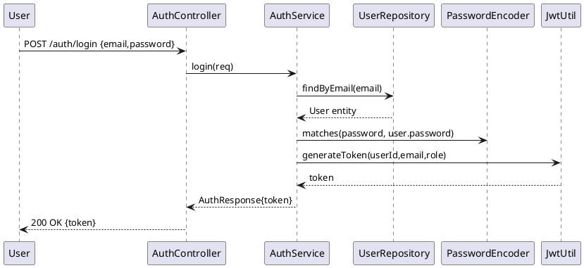
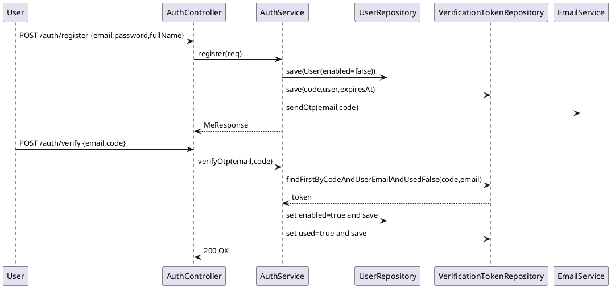

**Authentication Design**

- **Purpose**: describe Authentication, Registration, Email verification flows and DB tables for backend core.

**Use Cases**

- Authentication: user provides email+password 12 server verifies 12 returns JWT token.
- User Register: user provides email+password+profile 12 server creates disabled user, generates OTP verification token, sends email 12 user verifies with OTP 12 account enabled.
- Token Verify: user submits email+OTP 12 server checks token, marks used, activates account.
- Resend OTP: user requests new OTP 12 server creates new token and (re)emails.

**Class Diagram (text / PlantUML)**

```plantuml
@startuml
package auth {
  class User { +id, email, password, fullName, phone, enabled }
  class VerificationToken { +id, code, expiresAt, used, +user }
  class AuthController
  class AuthService
  class UserService
  class EmailService
}
package common {
  class JwtUtil
  class JwtAuthFilter
  class SecurityConfig
}
AuthController --> AuthService
AuthService --> User
AuthService --> VerificationToken
AuthService --> EmailService
JwtAuthFilter --> JwtUtil
JwtAuthFilter --> UserService
JwtUtil ..> User : signs token with userId/email/role
@enduml
```

**Sequence Diagram: Login flow**



**Sequence Diagram: Register & Email verify flow**



**DB Tables**

- `users` (id PK, email unique, password, full_name, phone, role, enabled, created_at, updated_at)
- `verification_tokens` (id PK, code, user_id FK -> users(id), expires_at, used boolean, created_at)
- `audit_logs` (id PK, action, actor_id FK -> users(id), created_at, details, entity_type, entity_id)

End of document.
